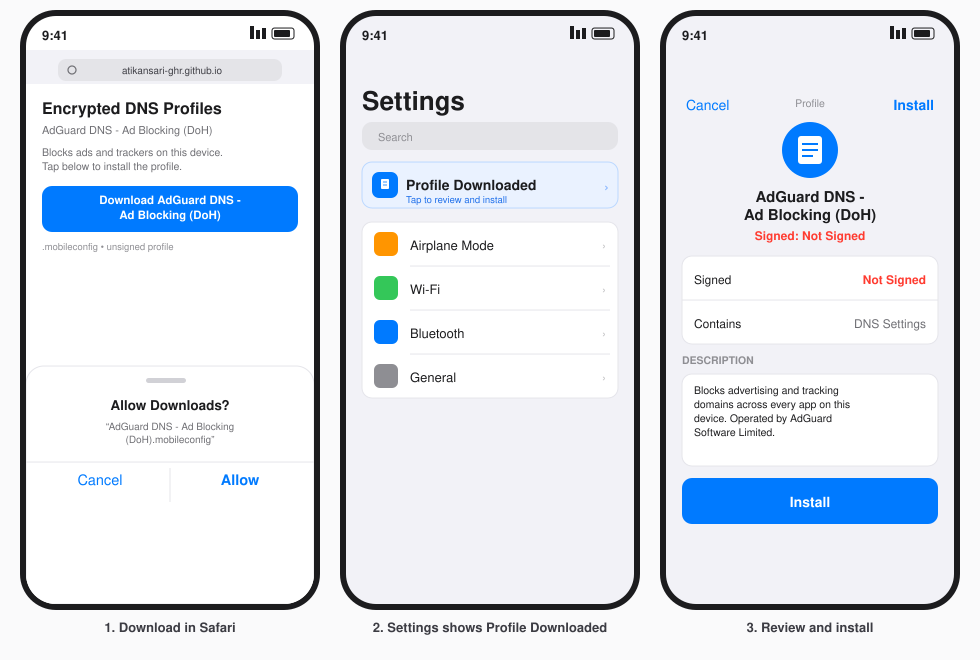
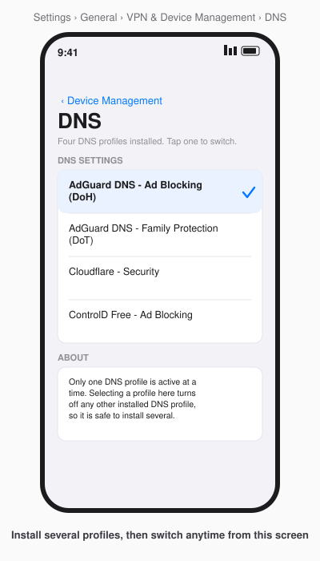
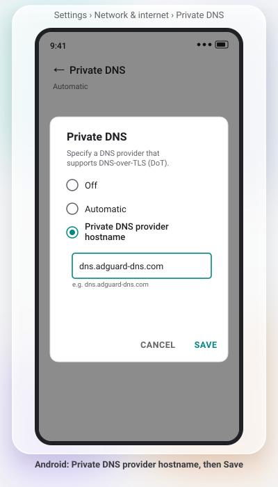
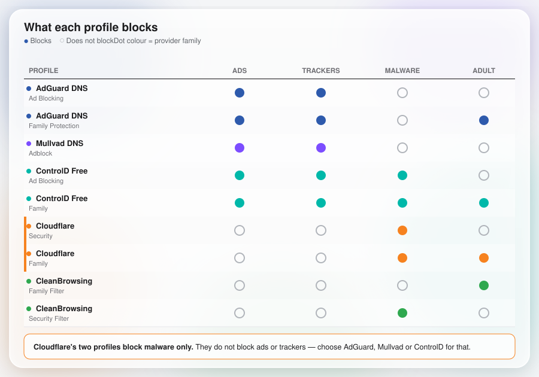

# Encrypted DNS Profiles

[](https://github.com/atikansari-ghr/encrypted-dns-profiles/actions/workflows/validate.yml)
[](https://github.com/atikansari-ghr/encrypted-dns-profiles/actions/workflows/endpoints.yml)
[](LICENSE)

Ready-to-install DNS configuration profiles that switch your device to an encrypted resolver, headlined by AdGuard's ad-blocking and family-protection resolvers. Tap a link, install the profile, and it applies to every app on the device in under a minute — no app to install, no account, and no VPN. Only DNS lookups move to the new resolver, encrypted; your actual traffic still goes straight to each site, exactly as before.

Install site: **[atikansari-ghr.github.io/encrypted-dns-profiles](https://atikansari-ghr.github.io/encrypted-dns-profiles)**

## Screenshots

*Illustrative mockups, not real screenshots.*

| | |
|---|---|
|  |  |
| Installing a profile on iOS | Switching between installed profiles |
|  |  |
| Setting Private DNS on Android | What each provider blocks, at a glance |

## What each provider blocks

A DNS-level blocklist is not an ad blocker in the browser-extension sense — it stops ad and tracking *domains* from resolving, which removes most ads and all tracking pixels served from those domains, but not everything a browser extension would catch. Read the table before you pick a profile: the two Cloudflare profiles are here for their reliability and low latency, not for ad blocking.

| Profile | Blocks | DoT hostname |
|---|---|---|
| AdGuard DNS - Ad Blocking | Ads, trackers | `dns.adguard-dns.com` |
| AdGuard DNS - Family Protection | Ads, trackers, adult content, enforces safe search | `family.adguard-dns.com` |
| Mullvad DNS - Adblock | Ads, trackers, no query logging | `adblock.dns.mullvad.net` |
| ControlD Free - Ad Blocking | Ads, trackers, malware | `p2.freedns.controld.com` |
| ControlD Free - Family | Ads, trackers, malware, adult content | `family.freedns.controld.com` |
| Cloudflare - Security | Malware only — **does not block ads** | `security.cloudflare-dns.com` |
| Cloudflare - Family | Malware and adult content — **does not block ads** | `family.cloudflare-dns.com` |
| CleanBrowsing - Family Filter | Adult content, enforces safe search | `family-filter-dns.cleanbrowsing.org` |
| CleanBrowsing - Security Filter | Malware, phishing | `security-filter-dns.cleanbrowsing.org` |

## Install on iPhone or iPad

Requires **iOS 14 / iPadOS 14 or later**.

1. On your device, open the [install site](https://atikansari-ghr.github.io/encrypted-dns-profiles) and tap **Install (DoH)** on the profile you want. (DoT also works on iOS if you prefer it — see the troubleshooting section below for when to switch.)
2. Safari opens Settings and shows **Profile Downloaded**. Tap it.
3. Tap **Install** in the top-right corner, enter your device passcode if asked, then tap **Install** again on the two confirmation screens.

You can install more than one profile; iOS keeps them all and lets you pick which one is active under **Settings → General → VPN & Device Management**.

**You will see a red "Not Signed" warning on the install screen — this is expected.** These profiles are not cryptographically signed by a paid Apple Developer certificate, so iOS marks them "Not Signed" in red. That does not mean the profile is unsafe or broken; it means Apple cannot vouch for who published it. Signing is deliberately not done here: a real signing certificate costs money and ties the profile to a paid developer account, and a self-signed certificate would produce the exact same red warning while buying nothing. Rather than hide the warning, read what the profile actually does — the XML is short, plain text, and browsable before you install anything, at [`docs/profiles/`](docs/profiles/).

## Install on Android

Android has **no equivalent of an Apple `.mobileconfig` file**. There is no profile to download and no per-app or per-network exception — Private DNS is a single system-wide switch, and it accepts **DNS-over-TLS (DoT) only**; none of the DoH profiles above have an Android equivalent. Requires **Android 9 or later**.

Use the DoT hostname from the table above.

**Stock Android:**

1. Open **Settings → Network & internet → Private DNS**.
2. Choose **Private DNS provider hostname**.
3. Enter the hostname, e.g. `dns.adguard-dns.com`.
4. Tap **Save**.

**Samsung (One UI):**

1. Open **Settings → Connections → More connection settings → Private DNS**.
2. Choose **Private DNS provider hostname**.
3. Enter the hostname and tap **Save**.

Or drive it from a computer with `adb` and [`scripts/android-private-dns.sh`](scripts/android-private-dns.sh), which reads hostnames straight out of `providers.toml`:

```bash
./scripts/android-private-dns.sh --set adguard-family
```

Run `--list` to see every available slug, `--status` to check what is currently set, and `--off` to disable Private DNS again.

## Install on macOS

Requires **macOS 11 or later**. The same `.mobileconfig` files used on iOS work here.

1. Click **Install (DoH)** on the [install site](https://atikansari-ghr.github.io/encrypted-dns-profiles); the file downloads to your Mac.
2. Open **System Settings → General → Device Management**.
3. Select the downloaded profile and click **Install**, entering your Mac password if asked.

The same "Not Signed" warning described above applies here too, and for the same reason.

## All profiles

Every variant, in both DoH and DoT. Links point at the install site, which serves the correct content type for a one-tap install; downloading straight from GitHub's raw file view shows the XML instead.

| Profile | DoH | DoT |
|---|---|---|
| AdGuard DNS - Ad Blocking | [Install](https://atikansari-ghr.github.io/encrypted-dns-profiles/profiles/adguard-default-doh.mobileconfig) | [Install](https://atikansari-ghr.github.io/encrypted-dns-profiles/profiles/adguard-default-dot.mobileconfig) |
| AdGuard DNS - Family Protection | [Install](https://atikansari-ghr.github.io/encrypted-dns-profiles/profiles/adguard-family-doh.mobileconfig) | [Install](https://atikansari-ghr.github.io/encrypted-dns-profiles/profiles/adguard-family-dot.mobileconfig) |
| Mullvad DNS - Adblock | [Install](https://atikansari-ghr.github.io/encrypted-dns-profiles/profiles/mullvad-adblock-doh.mobileconfig) | [Install](https://atikansari-ghr.github.io/encrypted-dns-profiles/profiles/mullvad-adblock-dot.mobileconfig) |
| ControlD Free - Ad Blocking | [Install](https://atikansari-ghr.github.io/encrypted-dns-profiles/profiles/controld-ads-doh.mobileconfig) | [Install](https://atikansari-ghr.github.io/encrypted-dns-profiles/profiles/controld-ads-dot.mobileconfig) |
| ControlD Free - Family | [Install](https://atikansari-ghr.github.io/encrypted-dns-profiles/profiles/controld-family-doh.mobileconfig) | [Install](https://atikansari-ghr.github.io/encrypted-dns-profiles/profiles/controld-family-dot.mobileconfig) |
| Cloudflare - Security | [Install](https://atikansari-ghr.github.io/encrypted-dns-profiles/profiles/cloudflare-security-doh.mobileconfig) | [Install](https://atikansari-ghr.github.io/encrypted-dns-profiles/profiles/cloudflare-security-dot.mobileconfig) |
| Cloudflare - Family | [Install](https://atikansari-ghr.github.io/encrypted-dns-profiles/profiles/cloudflare-family-doh.mobileconfig) | [Install](https://atikansari-ghr.github.io/encrypted-dns-profiles/profiles/cloudflare-family-dot.mobileconfig) |
| CleanBrowsing - Family Filter | [Install](https://atikansari-ghr.github.io/encrypted-dns-profiles/profiles/cleanbrowsing-family-doh.mobileconfig) | [Install](https://atikansari-ghr.github.io/encrypted-dns-profiles/profiles/cleanbrowsing-family-dot.mobileconfig) |
| CleanBrowsing - Security Filter | [Install](https://atikansari-ghr.github.io/encrypted-dns-profiles/profiles/cleanbrowsing-security-doh.mobileconfig) | [Install](https://atikansari-ghr.github.io/encrypted-dns-profiles/profiles/cleanbrowsing-security-dot.mobileconfig) |

## Check it is working

1. Visit your provider's DNS test page, for example `1.1.1.1/help` for Cloudflare, or the test page linked from the provider's homepage, and confirm it reports the expected resolver.
2. Load a page you know carries ads and confirm they no longer appear — for profiles that block ads; remember the two Cloudflare profiles do not.
3. If nothing changed, re-check **Settings → General → VPN & Device Management** (iOS/macOS) or **Private DNS** (Android) to confirm the profile is installed *and active*, not just downloaded.

## Add a provider

Every profile is generated from one file, `providers.toml` — **TOML, not YAML**. Adding a provider is a documented four-step loop:

```bash
# 1. Append a [[profiles]] block to providers.toml
# 2. Regenerate
python scripts/generate_profiles.py
# 3. Validate structure and endpoints
python scripts/validate_profiles.py
python scripts/check_endpoints.py
# 4. Run the tests, then open a pull request
python -m pytest
```

**Slugs are frozen once a profile is released.** Each profile's `PayloadUUID` is derived deterministically from its filename, and iOS uses that UUID to decide whether a newly installed profile replaces an existing one or creates a duplicate. Renaming a slug after release breaks that replace-on-reinstall behavior for everyone who already installed it — treat a slug change as a breaking change.

## Troubleshooting

**Safari shows raw XML instead of offering to install the profile.** This happens when a `.mobileconfig` is served as `text/plain`, which is what GitHub's raw file view does — always install from the [install site](https://atikansari-ghr.github.io/encrypted-dns-profiles), not from a raw GitHub link. If it still happens, use Safari's Share sheet to save the file, then open it from the Files app.

**The profile installs but DNS does not seem to change.** Check **Settings → General → VPN & Device Management** (iOS/macOS) or **Private DNS** (Android) to confirm the profile is actually active — installing it does not automatically make it the selected one if another DNS profile is already active. Only one DNS profile can be active at a time.

**A network blocks DNS-over-HTTPS.** Some corporate, school, and hotel networks block DoH to keep their own filtering in place. If a DoH profile stops working, install the DoT variant of the same provider instead. If DoT is blocked too, the device typically falls back to the network's own DNS.

**A VPN overrides the DNS profile.** Most VPN apps take over DNS resolution while connected, which suppresses the encrypted DNS profile regardless of which one is active. This is expected — a VPN and a DNS profile both want to control DNS, and the VPN wins. Disconnect the VPN to use the profile, or check whether your VPN provider offers equivalent DNS filtering.

**Removing a profile.** iOS/macOS: **Settings → General → VPN & Device Management** (or **System Settings → General → Device Management** on Mac), select the profile, then Remove. Android: open **Private DNS** and switch it back to **Automatic** or **Off**.

## Security notes

- A DNS resolver sees every domain your device resolves, even when the query itself is encrypted. Encryption protects the query from anyone else on the network path; it does nothing to hide it from the resolver's operator. Pick a provider whose logging policy you're comfortable with — the comparison table above names the operator for each one.
- Profiles are unsigned and their XML is readable before you install them, at [`docs/profiles/`](docs/profiles/). See "Not Signed" above for why.
- Each profile includes bootstrap IP addresses for its resolver, so it does not depend on the network's existing DNS to reach the encrypted resolver in the first place.
- The install site makes no external requests — no CDN, no web fonts, no analytics, no third-party script of any kind. Everything is inline and local.
- No telemetry, anywhere in this repository or the install site.

## Support

If this saved you some time, a coffee is always appreciated:

[](https://ko-fi.com/atikansari)

## Author

**Atik Ansari** — [github.com/atikansari-ghr](https://github.com/atikansari-ghr)

## License

[MIT](LICENSE)
